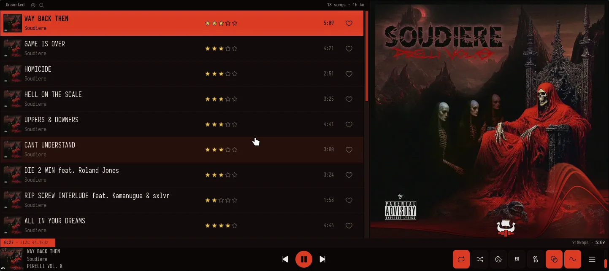

# Changelog

All notable changes to this project will be documented in this file.

## [Unreleased]

### Added

- **Trawl** — a mix builder living behind an anchor-marked row at the top of Harbour. Fill a crate with any mix of seeds — artists, albums, songs, genres, playlists — from a whole-library search inside the modal, or accrue them while browsing with the new right-click "Add to Mix" (library views, Similar, and the queue). Blend the crate three ways: **Interleave** (one track per seed, round-robin), **Weighted** (per-seed ‹ › weights, 1-5 tracks per pass), or **Shuffle all** (everything pooled and shuffled). **Minimum and maximum length** filters (default "1:00 or longer" / "No maximum") keep skits, interludes, and 20-minute epics out of songs pulled in by album, artist, genre, and playlist seeds — hand-picked songs always play, as do songs with unknown lengths. A **minimum rating** filter ("2 stars and up" … "5 stars only") narrows expanded seeds to songs you've rated — unrated songs don't survive it, and hand-picked songs are again exempt. A **max tracks** cap (25–200) bounds the whole mix, applied after blending so the blend's character survives the cut. Artist and genre seeds are sampled to 50 tracks so one genre can't swamp the mix; duplicates across seeds appear once. The crate persists while nokkvi runs (Play Mix keeps it for tweak-and-replay); Enter adds a seed, Ctrl+Enter plays the mix.

  

- **Harbour** — a new home view of collapsible discovery shelves: Recently Played tracks, Recently Added albums, Most Played (tracks, albums, artists, genres), and random playlists and genres as 2×2 cover mosaics (genre rows play ~100 random tracks). Centering a section header previews it in the large artwork column, and collapsed headers tease each section's newest or top pick with its cover art. The header hosts nokkvi's first **whole-library search**, matching across artists, albums, songs, genres, and playlists at once, with a "See all" on each group that opens the full view. Reached from a pinned longship button (right edge of the top nav, bottom of the sidebar), the `8` hotkey, `nokkvi switch-view harbour`, or as your start view.

  

### Changed

- The **Enthroned** theme now uses a warmer aged-ivory for its song-title text and visualizer skull peaks (keyed to the throne figure's own skull) instead of the near-white it shipped with, so both read as dirty bone rather than bleached white.

### Fixed

### Removed

## v0.14.2 — 2026-07-06

### Added

- **Love Change Notification** (Settings → Playback → Rating Reminder, off by default): an opt-in desktop notification when you love or unlove from the love hotkey or `nokkvi love`, for when the window is minimized or on another workspace. Clicking to star in-window stays silent. Mirrors the existing Rating Change Notification.
- **Enthroned theme**: a new original dark theme derived from the cover of Soudiere's *PIRELLI VOL. 8*. A warm near-black canvas under bone-white text, a deep robe-scarlet accent, ember-orange alerts, tarnished bronze-gold ratings, and a visualizer of blood-red bars capped with cold bone-white skull peaks. Ships with a matching "bleached bone" light companion.

  

### Changed

- On the Lucide icon set, the Songs and Queue top-nav tabs now use clearer glyphs (a single note; a list with a play arrow) instead of two near-identical beamed notes.

### Fixed

- A malformed server response on the Genres or Playlists views is now logged with a response preview instead of silently showing an empty list.

### Removed

- The **Kanagawa Dragon** theme (the base **Kanagawa** theme stays).

## v0.14.1 — 2026-07-05

### Added

- **Drag to the edge to auto-scroll**: dragging a queue or playlist track near the top or bottom edge now scrolls the list automatically (about 10 rows per second).

### Fixed

- Reordering a queue or playlist track no longer makes the lifted row cycle through other tracks when you scroll the list mid-drag.
- The playlist editor no longer drops a reorder on the wrong track when the list scrolls between grabbing a row and releasing it.

## v0.14.0 — 2026-07-04

### Added

- **Crossfade Curve** picker (Settings → Playback → Transitions) with three shapes: Equal Power (the new default, steady loudness), Constant Gain (the previous ~3 dB midpoint dip), and Linear (a plain straight-line fade).
- **Minimum Track Length to Crossfade** slider (0–60 s): 0 blends everything including short interludes, 30 blends only full-length tracks (previously a fixed 10 s floor).
- **Keep Gapless Albums Seamless** (off by default) skips the blend when the next track continues the same album, so authored segues stay tight.
- A new **Fading** section under Settings → Playback:
  - **Smooth Track Starts** (on by default) ramps up the first ~20 ms of each track to remove the click when a skip or seek lands mid-waveform.
  - **Fade on Pause / Resume** and **Fade on Stop** (off by default, 20–500 ms): soft gain ramps so pausing, resuming, and stopping no longer click.
  - **Fade Radio Switches** (off by default): a short fade when starting a station or returning to the queue, timed to the stream's first real audio so it doesn't pop after the prebuffer.
  - **Fade on Skip** (Off / Boundary Fade / Crossfade, default Off, 1–4 s): manual Next/Previous, clicking a queue track, or playing from a browse view can fade out or blend into the next track instead of hard-cutting.
  - **Skip Silence Between Tracks** (off by default, never on bit-perfect streams): trims silent lead-ins from prepared tracks and starts the blend early over a silent outro.
  - **Gap / Overlap Trim** (−2 to +2 s): hold a moment of silence between tracks, or start the blend early.
  - **Snap Crossfade to Musical Bars** (off by default): rounds the blend to whole bars of the outgoing track's BPM tag so beats line up; ignored when a track has no BPM tag.

### Changed

- The default crossfade curve is now **Equal Power**, ending the ~3 dB loudness dip in the middle of blends between different songs.
- Fresh streams from play, seek, and skip now start with the ~20 ms de-click ramp (bit-perfect streams keep their instant onset).

### Fixed

- Crossfades on the default path (Crossfade on, Bit-Perfect off) no longer dip to near-silence in the middle of the blend.
- A crossfade into a network stream that stalls right after starting now recovers and skips past the stall instead of hanging on its residue.
- Cancelling a crossfade after its midpoint no longer leaves the visualizer spectrum frozen until the next track change.

## Older releases

- **v0.13.x** (2026-07-03, v0.13.0): [CHANGELOG-0.13.md](./changelog-archive/CHANGELOG-0.13.md)
- **v0.12.x** (2026-06-28 → 2026-07-02, v0.12.0–v0.12.2): [CHANGELOG-0.12.md](./changelog-archive/CHANGELOG-0.12.md)
- **v0.11.x** (2026-06-22 → 2026-06-25, v0.11.0–v0.11.3): [CHANGELOG-0.11.md](./changelog-archive/CHANGELOG-0.11.md)
- **v0.10.x** (2026-06-19 → 2026-06-21, v0.10.0–v0.10.1): [CHANGELOG-0.10.md](./changelog-archive/CHANGELOG-0.10.md)
- **v0.9.x** (2026-06-15 → 2026-06-18, v0.9.0–v0.9.4): [CHANGELOG-0.9.md](./changelog-archive/CHANGELOG-0.9.md)
- **v0.8.x** (2026-06-14, v0.8.0): [CHANGELOG-0.8.md](./changelog-archive/CHANGELOG-0.8.md)
- **v0.7.x** (2026-06-07 → 2026-06-10, v0.7.0–v0.7.2): [CHANGELOG-0.7.md](./changelog-archive/CHANGELOG-0.7.md)
- **v0.6.x** (2026-05-25 → 2026-06-06, v0.6.0–v0.6.10): [CHANGELOG-0.6.md](./changelog-archive/CHANGELOG-0.6.md)
- **v0.5.x** (2026-05-21 → 2026-05-24, v0.5.0–v0.5.3): [CHANGELOG-0.5.md](./changelog-archive/CHANGELOG-0.5.md)
- **v0.4.x** (2026-05-16 → 2026-05-19, v0.4.0–v0.4.2): [CHANGELOG-0.4.md](./changelog-archive/CHANGELOG-0.4.md)
- **v0.3.x** (2026-04-27 → 2026-05-14, v0.3.1–v0.3.17): [CHANGELOG-0.3.md](./changelog-archive/CHANGELOG-0.3.md)
