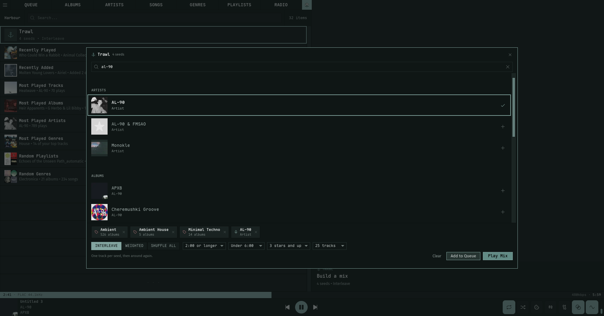

# Changelog

All notable changes to this project will be documented in this file.

## [Unreleased]

### Added

- **Queue sync with your Navidrome server.** Two new buttons in the Queue header push the current queue to the server and pull it back on any device (or a fresh session), including the playing track and its exact position. Pulling cues the restored queue without starting playback: if you were listening, it resumes mid-song right where the other device left off, and if you were paused, pressing Play picks up from the saved spot. Duplicate tracks survive the round trip (the sync rides the OpenSubsonic indexBasedQueue extension, so the playing slot is a position, not a track id), and huge queues are fine since saves go as POST form bodies. The buttons appear once the server advertises the extension (Navidrome 0.58.5 and newer); `nokkvi queue-push` and `nokkvi queue-pull` do the same from the command line.
- Trawl's rating filter gains "Unrated only", for mixes built purely from songs you haven't rated yet.

### Changed

- The default start view is now Harbour: new installs open on the home shelves, and users still on the old default move there too.

### Fixed

- Hovering the Queue's "Playing From" banner for a description-less playlist no longer shows a blank gap; the stats row now sits flush under the title.

### Removed

## v0.15.1 — 2026-07-11

### Added

- Trawl filters are keyboard-editable: Shift+Tab / Shift+Backspace pick a tray control, Left/Right cycle its value.
- The Trawl row's artwork panel now animates the longship trawling its anchor across a living day/night sea of stars, aurora, sun, and gulls.

### Fixed

- Pressing `/` inside the Trawl modal no longer reveals the auto-hide toolbar of the view behind it.
- Shift+A inside the Trawl modal now adds the mix to the queue, the keyboard sibling of Ctrl+Enter's Play Mix.
- Trawl's Add to Queue and Play Mix now toast an explanation when the crate is empty instead of doing nothing.
- The Lines visualizer's sailing boat and its anchor now clip at the wave area's edges instead of drifting over the sidebar or neighbouring panels.

## v0.15.0 — 2026-07-09

### Added

- **Trawl** — a mix builder living behind an anchor-marked row at the top of Harbour. Fill a crate with any mix of seeds — artists, albums, songs, genres, playlists — from a whole-library search inside the modal, or accrue them while browsing with the new right-click "Add to Mix" (library views, Similar, and the queue). Blend the crate three ways: **Interleave** (one track per seed, round-robin), **Weighted** (per-seed ‹ › weights, 1-5 tracks per pass), or **Shuffle all** (everything pooled and shuffled). **Minimum and maximum length** filters (default "1:00 or longer" / "No maximum") keep skits, interludes, and 20-minute epics out of songs pulled in by album, artist, genre, and playlist seeds — hand-picked songs always play, as do songs with unknown lengths. A **minimum rating** filter ("2 stars and up" … "5 stars only") narrows expanded seeds to songs you've rated — unrated songs don't survive it, and hand-picked songs are again exempt. A **max tracks** cap (25–200) bounds the whole mix, applied after blending so the blend's character survives the cut. Artist and genre seeds are sampled to 50 tracks so one genre can't swamp the mix; duplicates across seeds appear once. The crate persists while nokkvi runs (Play Mix keeps it for tweak-and-replay); Enter adds a seed, Ctrl+Enter plays the mix.

  

- **Harbour** — a new home view of collapsible discovery shelves: Recently Played tracks, Recently Added albums, Most Played (tracks, albums, artists, genres), and random playlists and genres as 2×2 cover mosaics (genre rows play ~100 random tracks). Centering a section header previews it in the large artwork column, and collapsed headers tease each section's newest or top pick with its cover art. The header hosts nokkvi's first **whole-library search**, matching across artists, albums, songs, genres, and playlists at once, with a "See all" on each group that opens the full view. Reached from a pinned longship button (right edge of the top nav, bottom of the sidebar), the `8` hotkey, `nokkvi switch-view harbour`, or as your start view. Shelves refresh on every visit — Recently Played and Most Played stay current with what you actually played, and the random shelves deal fresh picks each time.

  

### Changed

- The **Enthroned** theme now uses a warmer aged-ivory for its song-title text and visualizer skull peaks (keyed to the throne figure's own skull) instead of the near-white it shipped with, so both read as dirty bone rather than bleached white.

## Older releases

- **v0.14.x** (2026-07-04 → 2026-07-06, v0.14.0–v0.14.2): [CHANGELOG-0.14.md](./changelog-archive/CHANGELOG-0.14.md)
- **v0.13.x** (2026-07-03, v0.13.0): [CHANGELOG-0.13.md](./changelog-archive/CHANGELOG-0.13.md)
- **v0.12.x** (2026-06-28 → 2026-07-02, v0.12.0–v0.12.2): [CHANGELOG-0.12.md](./changelog-archive/CHANGELOG-0.12.md)
- **v0.11.x** (2026-06-22 → 2026-06-25, v0.11.0–v0.11.3): [CHANGELOG-0.11.md](./changelog-archive/CHANGELOG-0.11.md)
- **v0.10.x** (2026-06-19 → 2026-06-21, v0.10.0–v0.10.1): [CHANGELOG-0.10.md](./changelog-archive/CHANGELOG-0.10.md)
- **v0.9.x** (2026-06-15 → 2026-06-18, v0.9.0–v0.9.4): [CHANGELOG-0.9.md](./changelog-archive/CHANGELOG-0.9.md)
- **v0.8.x** (2026-06-14, v0.8.0): [CHANGELOG-0.8.md](./changelog-archive/CHANGELOG-0.8.md)
- **v0.7.x** (2026-06-07 → 2026-06-10, v0.7.0–v0.7.2): [CHANGELOG-0.7.md](./changelog-archive/CHANGELOG-0.7.md)
- **v0.6.x** (2026-05-25 → 2026-06-06, v0.6.0–v0.6.10): [CHANGELOG-0.6.md](./changelog-archive/CHANGELOG-0.6.md)
- **v0.5.x** (2026-05-21 → 2026-05-24, v0.5.0–v0.5.3): [CHANGELOG-0.5.md](./changelog-archive/CHANGELOG-0.5.md)
- **v0.4.x** (2026-05-16 → 2026-05-19, v0.4.0–v0.4.2): [CHANGELOG-0.4.md](./changelog-archive/CHANGELOG-0.4.md)
- **v0.3.x** (2026-04-27 → 2026-05-14, v0.3.1–v0.3.17): [CHANGELOG-0.3.md](./changelog-archive/CHANGELOG-0.3.md)
