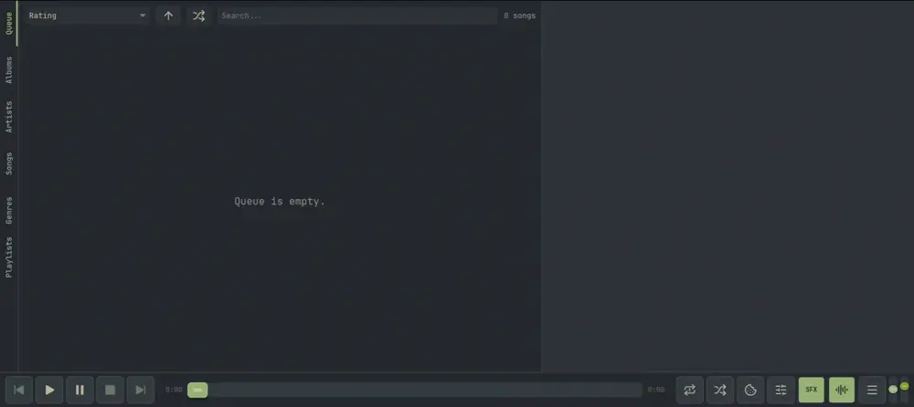

# Nokkvi

A native Rust/Iced client for [Navidrome](https://www.navidrome.org/) music server. Named after Old Norse *nökkvi*, a small, humble boat.

*Demo showcasing Nokkvi's GPU-accelerated audio visualizers and instant theme hot-reloading in action (automated via a script).*


> **⚠️ AI-Generated Project**
>
> This entire codebase was written by AI (primarily Claude) with my direction. I'm not a developer. I come up with the ideas, test things, and use this as my daily music player, but I don't write code myself. You'll probably find patterns in here that experienced Rust developers would do differently. If you spot something that could be better, issues and PRs are welcome.

**Platform:** Linux only. Built and tested on Arch Linux (Wayland/Hyprland) with PipeWire v<!-- pipewire-version -->1.6.4<!-- /pipewire-version --> and Navidrome v<!-- navidrome-version -->0.61.2<!-- /navidrome-version -->. No Windows or macOS support.
**Network:** Designed and tested as a local network client (LAN). Performance over WAN is unknown.

## 📖 Documentation

Full guides, config reference, keyboard shortcuts, theming, and visualizer details are at the **[Nokkvi docs site](https://f-o-o-g-s.github.io/nokkvi-docs/)**.

## Inspirations

Things that shaped this project:

- **[rmpc](https://github.com/mierak/rmpc)**: My previous daily driver, a terminal MPD client.
- **[Feishin](https://github.com/jeffvli/feishin)**: Referenced heavily for Navidrome API coverage and enums.
- **[mpd](https://github.com/MusicPlayerDaemon/MPD)**: Shaped the queue and consume logic.
- **[fooyin](https://github.com/fooyin/fooyin)**: Referenced for the native PipeWire implementation.
- **[StepMania](https://github.com/stepmania/stepmania)**: Inspired the drill-down settings navigation.
- **Vim**: Inspired the color schemes and keyboard-first approach.

## Highlights

- Native PipeWire audio engine with gapless playback, crossfade, AGC + ReplayGain volume normalization, and a 10-band EQ
- GPU-accelerated visualizer with `bars` and `lines` modes, gradient controls, and peak indicators
- Browse albums, artists, songs, genres, playlists, internet radios, and similar artists; inline expansion and split-view browsing included
- 21 built-in themes (Gruvbox, Catppuccin, Dracula, Nord, Tokyo Night, Kanagawa, Everforest, ...) with instant hot-reload; drop a `.toml` in `~/.config/nokkvi/themes/` to add your own
- Persistent queue, multi-selection, drag-and-drop, star ratings, and scrobbling (Last.fm / ListenBrainz)
- Fully keyboard-driven with configurable shortcuts, MPRIS, optional system tray icon, and right-click menus everywhere
- Designed on a tiling WM — player bar folds controls into a kebab menu as width shrinks; library views use a **slot-paginated list** (the viewport is a fixed odd number of whole-row slots — never partials) where the slot count adapts to window height (up to 29) and text, album artwork, and star icons scale with each slot

Full feature tour and `config.toml` reference: [docs](https://f-o-o-g-s.github.io/nokkvi-docs/).

### Non-Goals

Nokkvi is a fast, keyboard-driven music player, not a Navidrome admin panel. These features are intentionally left out for now:
- Server administration (library scans, user management)
- Podcasts
- Jukebox mode
- Smart playlist generation
- Bookmarks
- Public sharing links
- Offline download
- Lyrics

## Download

**Prebuilt binary (x86_64 Linux):** grab the latest tarball from [Releases](https://github.com/f-o-o-g-s/nokkvi/releases). Each release ships `nokkvi-vX.Y.Z-x86_64-unknown-linux-gnu.tar.gz` plus a matching `.sha256`. Verify, extract, and install:

```bash
sha256sum -c nokkvi-vX.Y.Z-x86_64-unknown-linux-gnu.tar.gz.sha256
tar xzf nokkvi-vX.Y.Z-x86_64-unknown-linux-gnu.tar.gz
cd nokkvi-vX.Y.Z-x86_64-unknown-linux-gnu
./install.sh
```

Runtime requirements: `pipewire` and `fontconfig` installed system-wide (Arch: `sudo pacman -S pipewire fontconfig`).

**Arch (AUR):** [`nokkvi-bin`](https://aur.archlinux.org/packages/nokkvi-bin) tracks the released tarballs above; [`nokkvi-git`](https://aur.archlinux.org/packages/nokkvi-git) builds from `main`. Install with your AUR helper of choice (e.g. `yay -S nokkvi-bin` or `paru -S nokkvi-bin`).

## Quickstart (build from source)

```bash
sudo pacman -S pipewire fontconfig pkgconf       # Arch system deps
cargo build --release                           # build
./install.sh                                    # install binary, .desktop, icon
```

The binary goes to `target/release/nokkvi`; `install.sh` copies it to `~/.local/bin/nokkvi` with the desktop entry and icon. Config lives in `~/.config/nokkvi/`; runtime state and logs live in `~/.local/state/nokkvi/`.

More detail in the docs:
- [Installation](https://f-o-o-g-s.github.io/nokkvi-docs/guides/installation/)
- [Connecting to Navidrome](https://f-o-o-g-s.github.io/nokkvi-docs/guides/navidrome/)
- [Configuration reference](https://f-o-o-g-s.github.io/nokkvi-docs/reference/config/)
- [Keyboard shortcuts](https://f-o-o-g-s.github.io/nokkvi-docs/reference/hotkeys/)
- [Media controls (MPRIS)](https://f-o-o-g-s.github.io/nokkvi-docs/guides/mpris/)

Build setup and contributor workflow (including the **nightly** rustfmt requirement) are in [CONTRIBUTING.md](CONTRIBUTING.md).

## Contributing

See [CONTRIBUTING.md](CONTRIBUTING.md) for build instructions, guidelines, and the AI disclosure.

## Support

Nokkvi is free and open source. If you'd like to chip in, you can buy me a coffee on Ko-fi:

[](https://ko-fi.com/foogsnokkvi)

## License

[GNU General Public License v3.0](LICENSE). See [THIRD-PARTY-LICENSES.md](THIRD-PARTY-LICENSES.md) for third-party attribution.
